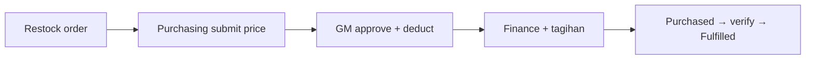

# Procurement Unification — Phase 3 Overview

Dokumen arsitektur ringkas untuk modul penyatuan pembelian: Order sebagai tunggal sumber kebenaran, Supplier & Tagihan, Stock Out.

## Workflow — PROJECT_REQUEST

```mermaid
flowchart LR
  subgraph pm [PM]
    A[Draft + items]
  end
  subgraph admin_stock [Admin Stok]
    B[PENDING_ADMIN_STOCK submit harga/qty final]
  end
  subgraph purchasing [Purchasing]
    C[PENDING_PURCHASING_INPUT supplier + unit price]
  end
  subgraph ops [Ops Manager]
    D[PENDING_OPS_APPROVAL]
  end
  subgraph gm [GM]
    E[PENDING_GM_APPROVAL + deduct budget + PO PDF]
  end
  subgraph finance [Finance]
    F[PENDING_PAYMENT_RECEIPT tagihan + receipt URL]
    G[PURCHASED]
  end
  subgraph verify [Admin Stok]
    H[Verifikasi barang → FULFILLED]
  end
  A --> B --> C --> D --> E --> F --> G --> H
```

## Workflow — STOCK_RESTOCK

- Langsung **PENDING_PURCHASING_INPUT** (tanpa tiket Admin Stok).
- Setelah submit price Purchasing: **PENDING_GM_APPROVAL** (tanpa Ops).
- Sisanya sama: GM deduct + PO → Finance → Purchased → verifikasi.

## Modul — dependency garis besar

- **Order** — status tunggal, `orderTrigger`, `financeProjectId`, relasi Supplier, SupplierInvoice (1:1 per order untuk tagihan), PO fields.
- **Purchasing** — inbox count, POST submit-price.
- **Supplier** — master data; dipilih pada submit price.
- **SupplierInvoice** — upload, kirim email, ACK/reject supplier (oleh Finance).
- **StockOut** — permintaan keluar barang; Admin Stok fulfill/reject.

## Status Order (inti Phase 3)

| Status | Keterangan singkat |
|--------|---------------------|
| PENDING_PURCHASING_INPUT | Tunggu harga & supplier dari Purchasing |
| PENDING_OPS_APPROVAL | PROJECT_REQUEST — tunggu Ops |
| PENDING_GM_APPROVAL | Tunggu GM (deduct pada approve) |
| PENDING_PAYMENT_RECEIPT | Tunggu Finance (tagihan + bukti, tanpa deduct ulang) |
| PURCHASED | Dibayar / diproses Finance — Admin siap verifikasi |
| PENDING_VERIFICATION | Verifikasi ulang barang |
| FULFILLED | Selesai |
| REJECTED_BY_* | Tolak Ops/GM dengan alasan |
| CANCELLED | Batal; refund materi jika sudah deduct |

## Izin — matriks tinggi level

Detail definitif ada di `apps/api/src/auth/permissions.ts`; ringkas:

- **ADMIN_STOCK** — submit Admin Stok, verifikasi, restock entry, inbox Stock Out, fulfill Stock Out.
- **PURCHASING** — inbox order harga, submit price, kirim PO email.
- **OPERATIONAL_MANAGER** — approve PROJECT_REQUEST setelah Purchasing.
- **GENERAL_MANAGER** — approve GM, cancel dalam kebijakan API.
- **FINANCE** — tagihan supplier, konfirmasi `finance-process` (receipt URL), refund/cancel pasca-deduct sesuai aturan backend.

## Email

- PO ke supplier email (Purchasing action setelah GM).
- Tagihan ke supplier dengan lampiran PDF (jika storage dapat diunduh).
- Opsional env **`PROCUREMENT_FROM_EMAIL`** — lihat deployment doc; fallback ke SMTP from yang sama.

## Realtime

Event Socket.IO dipancarkan ke room `role:{ROLE}` atau `user:{userId}` (lihat NotificationsGateway / Order / Purchasing / SupplierInvoice / StockOut services). UI dashboard (`layout.tsx`) menampilkan toast dan menyegarkan badge inbox Purchasing / Stock Out.
